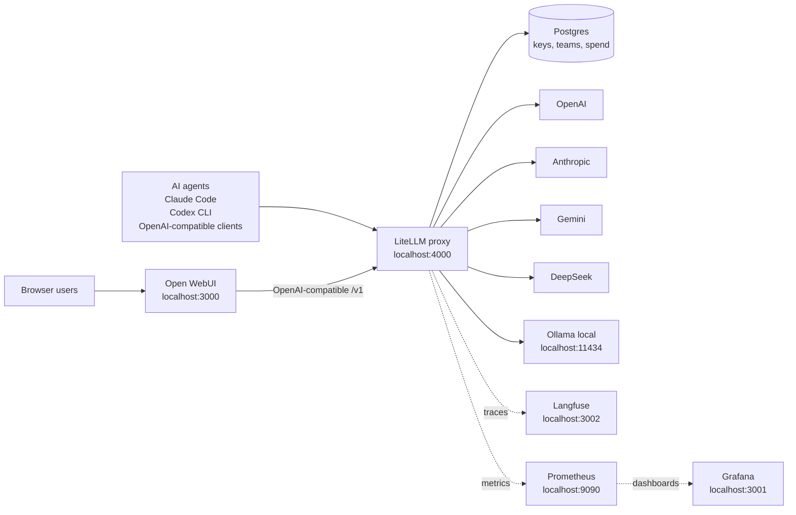

# LiteLLM + Open WebUI PoC

A local Docker Compose stack for running one AI gateway in front of many model
providers. Open WebUI gives users a chat UI, while LiteLLM centralizes routing,
virtual keys, budgets, spend logs, fallbacks, and OpenAI-compatible access for
AI agents and coding tools.

Use it to test a practical company AI setup before committing to a heavier
platform: one controlled entry point for OpenAI, Anthropic, Gemini, DeepSeek,
local Ollama, Claude Code, Codex CLI, and other compatible clients.

## Why this exists

- One chat UI for many models through Open WebUI.
- One API gateway for humans, AI agents, and coding CLIs.
- Virtual keys with per-user or per-team budgets.
- Spend tracking so company subscriptions do not disappear into unmanaged use.
- Provider fallback and a `smart` alias for routing across backends.
- Optional local model fallback with Ollama.
- Optional observability with Langfuse traces, Prometheus metrics, and Grafana dashboards.

For companies, the useful pattern is not only "switch providers." It is putting
company-funded AI access behind company-owned controls: scoped keys, transparent
usage logs, budget ceilings, and separate access for experiments, internal
agents, production automations, and personal side projects. Use this with clear
internal policy; it is meant for accountable usage management, not covert
monitoring.

## Architecture



## Choose Your Stack

| Mode | Command | Includes |
|---|---|---|
| Minimal | `docker compose -f docker-compose.yml -f docker-compose.minimal.yml up -d` | LiteLLM, Open WebUI, Postgres |
| Full demo | `docker compose up -d` | Minimal stack plus Ollama, Langfuse, Prometheus, Grafana |

Postgres is included in both modes because LiteLLM needs it for virtual keys,
teams, budgets, spend logs, and the admin UI.

## Prerequisites

- Docker and Docker Compose v2 (`docker compose`).
- At least one provider API key, unless you only want to test the local Ollama path.
- Enough RAM for Open WebUI, LiteLLM, Postgres, and optional observability services.

## Services

| Service | Port | Purpose |
|---|---:|---|
| Open WebUI | 3000 | Chat UI backed by LiteLLM |
| LiteLLM proxy | 4000 | Gateway, routing, virtual keys, budgets, spend tracking |
| Grafana | 3001 | Metrics dashboards over Prometheus |
| Langfuse | 3002 | Traces, prompts, and request observability |
| Prometheus | 9090 | Scrapes LiteLLM metrics |
| Ollama | 11434 | Local model runner for offline/local fallback |
| Postgres | internal | Stores LiteLLM keys, teams, budgets, spend |

Preconfigured model aliases include `gpt-5.5`, `claude-opus-4.8`,
`claude-sonnet-4.6`, `claude-haiku`, `gemini-2.5-pro`,
`gemini-2.5-flash`, `deepseek-v4-pro`, `deepseek-v4-flash`,
`llama3.1-local`, and `smart`.

## Quick Start

```bash
git clone https://github.com/alexdavliatov/litellm-poc.git
cd litellm-poc

./setup.sh
docker compose up -d

open http://localhost:3000     # Open WebUI
open http://localhost:4000/ui  # LiteLLM admin UI
```

Log in to LiteLLM with the `LITELLM_MASTER_KEY` printed by `setup.sh` and saved
in `.env`.

For the lightweight version:

```bash
./setup.sh
docker compose -f docker-compose.yml -f docker-compose.minimal.yml up -d
```

If you prefer to edit values yourself:

```bash
cp .env.example .env
$EDITOR .env
docker compose up -d
```

## Five-Minute Demo

1. Open `http://localhost:3000` and create the first Open WebUI account.
2. Open `http://localhost:4000/ui` and log in with `LITELLM_MASTER_KEY`.
3. Create a LiteLLM virtual key with a small budget.
4. Send a chat request through Open WebUI or any OpenAI-compatible client.
5. Check LiteLLM usage logs; in full mode, also check Langfuse and Grafana.

The `pitch-screenshots/` folder contains example screenshots for the chat UI,
LiteLLM usage views, Langfuse traces, and Grafana dashboards.

## Screenshots


## Virtual Keys and Budgets

Virtual keys let you give users, teams, AI agents, and automation jobs scoped
access without exposing provider keys or the LiteLLM master key.

Via UI: `http://localhost:4000/ui` -> Virtual Keys -> Create Key

Via API:

```bash
source .env
curl -X POST http://localhost:4000/key/generate \
  -H "Authorization: Bearer $LITELLM_MASTER_KEY" \
  -H "Content-Type: application/json" \
  -d '{"models":["claude-sonnet-4.6","gpt-5.5"],"max_budget":5,"key_alias":"demo-key"}'
```

Use the returned `sk-...` key wherever you would normally use an OpenAI API key.
Spend is tracked per key, so teams can separate employee chat usage, coding
agents, background automations, experiments, and production workloads.

## AI Agents and Coding Tools

Any client that supports an OpenAI-compatible base URL can use LiteLLM:

```text
base_url: http://localhost:4000/v1
api_key:  <LiteLLM virtual key>
```

Claude Code can use LiteLLM's Anthropic-compatible endpoint:

```bash
export ANTHROPIC_BASE_URL=http://localhost:4000
export ANTHROPIC_AUTH_TOKEN=<virtual-key>
export ANTHROPIC_MODEL=claude-sonnet-4.6
export ANTHROPIC_SMALL_FAST_MODEL=claude-haiku
claude
```

Codex CLI can target LiteLLM through the Responses API:

```toml
model = "gpt-5.5"
model_provider = "litellm"

[model_providers.litellm]
name = "LiteLLM"
base_url = "http://localhost:4000/v1"
env_key = "LITELLM_API_KEY"
wire_api = "responses"
```

```bash
export LITELLM_API_KEY=<virtual-key>
codex
```

Provider-switching tools can also sit in front of this setup as long as they can
switch OpenAI-compatible or Anthropic-compatible base URLs. Keep LiteLLM as the
controlled company gateway and use switchers only as client-side convenience.

More detailed CLI notes are in `CLI-SETUP.md`.

## Team Migration (`migrate.sh`)

`migrate.sh` moves a teammate's Claude Code, Claude Desktop, and Codex from cloud
onto the shared LiteLLM gateway, via
[cc-switch](https://github.com/farion1231/cc-switch). It clones each person's
**own** current cc-switch profiles and swaps only the connection (gateway URL,
virtual key, model aliases), so their existing plugins, MCP servers, and skills
are preserved. Nothing personal is baked in. The cc-switch DB is backed up
before any write; existing profiles are never modified.

The gateway URL and model aliases live at the top of the script (`GATEWAY`,
`ALIAS_*`). Edit them there if the gateway or its model names change.

Subcommands:

| Command | What |
|---|---|
| `install` | Install cc-switch (`brew install --cask cc-switch`) and check deps. |
| `import` (alias `migrate`) | Clone your own profiles, create `LiteLLM Local` profiles + a `litellm-local.env` snippet. |
| `status` | Show cc-switch profiles, the active one, and gateway reachability. |
| `rollback` | Restore the most recent cc-switch DB backup. |

**Each teammate:**

```bash
./migrate.sh install                 # installs cc-switch, checks deps
./migrate.sh import                  # prompts for their own LiteLLM virtual key
# then: cc-switch app -> pick 'LiteLLM Local' per app
#   or: source litellm-local.env && claude
```

Flags for `import`: `--key sk-x` (non-interactive), `--mint` (mint a key via
`LITELLM_MASTER_KEY` in `.env`), `--activate` (switch Claude Code + Codex now;
Claude Desktop is switched in the cc-switch app), `--dry-run`, `--claude-only` /
`--desktop-only` / `--codex-only`, and per-app skips.

**Roll back:** `./migrate.sh rollback`, or pick your old profile in cc-switch.

> Claude Desktop requires cc-switch (it reads no shell env). Codex runs against a
> Claude model through the gateway's Responses API. Gemini CLI and Cursor are out
> of scope: Cursor is not managed by cc-switch (set its base URL by hand in
> Settings -> Models if needed; only basic model calls proxy).

## Configuration

Add or remove models in:

- `litellm-config.yaml` for the full demo.
- `litellm-config.minimal.yaml` for the lightweight stack.

Restart LiteLLM after config changes:

```bash
docker compose restart litellm
```

Leave a provider key blank or set it to a placeholder if you do not want to use
that provider. LiteLLM fallback rules route around unavailable models when a
fallback is configured.

To use the local model:

```bash
docker exec -it ollama ollama pull llama3.1
```

## Useful Commands

```bash
docker compose up -d
docker compose -f docker-compose.yml -f docker-compose.minimal.yml up -d
docker compose down
docker compose down -v
docker compose logs -f litellm
curl http://localhost:4000/v1/models -H "Authorization: Bearer $LITELLM_MASTER_KEY"
```

## Not Production-Ready As-Is

This is a local PoC. Before exposing it to a company or the internet, add TLS
and a reverse proxy, lock down Open WebUI registration, use scoped virtual keys
instead of the master key, move secrets into a secret manager, configure SSO/OIDC
where needed, use managed Postgres with backups, and document your internal AI
usage policy.
